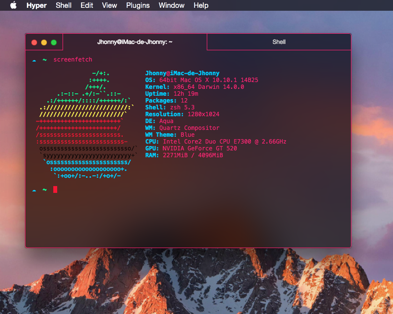

# hyper-pinker

> [Hyper](https://hyper.is) Hyper theme based in pink colors and vibrancy.

## Install

Add `hyper-pinker` to the plugins list in your `~/.hyper.js` config file.

## License

MIT © [Jhonny Arana](https://github.com/aranajhonny)
